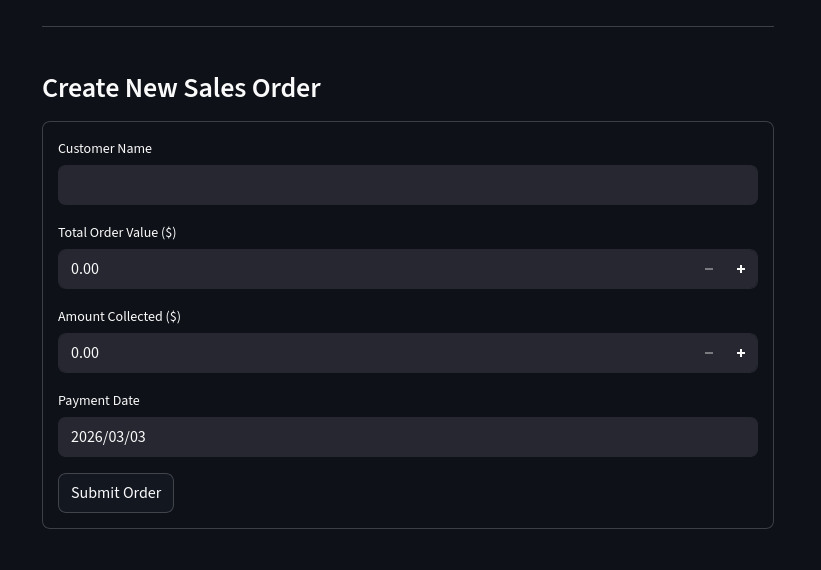

# Mini ERP System – Order & Payment Tracking

A lightweight internal ERP prototype built to replace Excel-based customer order tracking with a structured, database-driven system.

This project focuses on clean relational modeling, transaction safety, and financial correctness — while keeping the system simple and maintainable.

---

## Why This Project?

Many small businesses track sales data in Excel using formats like:

| Customer Name | Total Order Value ($) | Total Collected ($) | Outstanding Balance ($) | Last Payment Date |

While simple, this approach creates problems:

- No relational integrity  
- Risk of duplicate customer entries  
- Manual outstanding calculations  
- No transaction safety  
- Difficult multi-user handling  
- No automation capability  

This project converts that spreadsheet workflow into a structured ERP-style system backed by PostgreSQL.

---

## What This System Does

- Create and manage customers  
- Create sales orders  
- Record payments  
- Automatically calculate outstanding balance  
- Enforce relational constraints  
- Prevent orphan records  
- Ensure ACID-compliant financial transactions  

---

## Architecture Overview

### Current Prototype

- Frontend: Streamlit  
- Database: PostgreSQL  
- Language: Python  

The prototype directly interacts with the database for simplicity.


## Database Design

Core Tables:

- customers  
- orders  
- payments  

Relationships:

customers (1) → (N) orders  
orders (1) → (N) payments  

This ensures:

- No orders without customers  
- No payments without orders  
- Clean outstanding balance calculation  
- Strong referential integrity  

---

## Application Screenshots

### Create New Order




---

## Setup Instructions

Follow these steps to run the project locally.

---

### 1. Clone the Repository

```bash
git clone <your-repo-url>
cd <project-folder>
```

### 2. Create and Activate Virtual Environment
```bash
python -m venv venv
source venv/bin/activate
```

### 3. Install Dependencies
```bash
pip install -r requirements.txt
```

### 4. Run the Application
```bash
streamlit run app.py
```
```markdown
The application will open at:
http://localhost:8501
```
