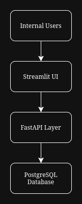

# System Architecture & Technology Stack

## 1. Architecture Overview

This ERP system is designed for:

- 1–2 developers
- 5–50 internal users
- Cost-effective deployment
- Maintainability and scalability
- Future automation and AI integration

The system follows a layered architecture:

- Presentation Layer (Streamlit - Prototype)
- Application Layer (FastAPI - Future Production Design)
- Data Layer (PostgreSQL)
- Integration Layer (Power Automate / AI)

This separation allows future UI or backend replacement without affecting the database design.

## 2. Technology Stack

### Database: PostgreSQL

Why PostgreSQL:

- Open-source and reliable
- Strong ACID compliance (important for financial data)
- Supports foreign keys and constraints
- Handles moderate concurrency efficiently
- Production-ready if system scales

### Backend (Production Design): FastAPI

Although the prototype directly interacts with the database, a production-ready system should introduce a backend API layer using FastAPI.

Reasons:

- High performance
- Automatic validation
- Clean REST API structure
- Easy integration with automation tools
- Future AI integration support

### Frontend: Streamlit (Prototype)

Streamlit is used for:

- Rapid development
- Internal dashboard-style UI
- Low complexity
- Easy deployment

For an internal ERP system, Streamlit is sufficient for the first version.

## 3. High-Level Flow

## 4. Scalability Strategy

Future improvements:

- Move business logic to FastAPI
- Add authentication and role management
- Add background workers for automation
- Integrate AI for forecasting and reporting

The current design supports these upgrades without restructuring the database.
