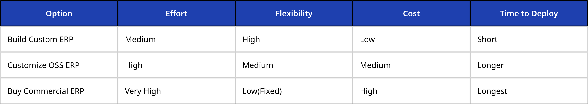

# Business Analysis & ERP Strategy

## 1. 🔍 Company Research & Initial Assessment

### Company Overview

Amba Enterprises Limited is a public limited company with a strong presence in power engineering solutions, primarily engaged in manufacturing and selling transformer core laminations, motor and generator stampings, slit coils, and related electrical steel products. The company has been operating since the mid-1990s and serves industries such as energy distribution, UPS manufacturing, electrical equipment, automobiles, and engineering sectors. :contentReference[oaicite:0]{index=0}

Amba Enterprises operates from multiple locations with a significant manufacturing capacity and employs experienced production teams focused on quality and timely output. :contentReference[oaicite:1]{index=1}

---

### Key Pain Points & Inefficiencies

#### Manual and Fragmented Financial Tracking

Amba’s current reporting, as illustrated in the provided Excel management report, indicates that sales order values, collected amounts, and balances are tracked manually using spreadsheets. This practice leads to fragmented data and inconsistent reconciliation across different business units.

**Impact:**  
Inconsistencies in financial figures, difficulty tracking customer payments in real time, and significant manual overhead for accountants.

---

#### Lack of Integrated Order Processing

The current Excel-based workflow does not enforce relationships between customers, orders, and payments. Without a structured system, data errors such as duplicate customer entries, missing order references, and incorrect outstanding calculations are common.

**Impact:**  
High manual effort to maintain data integrity and increased risk of errors in reporting and decision-making.

---

#### No Real-Time Financial Insights or Automation

There is no centralized platform to instantly derive key business metrics such as outstanding balances, revenue summaries, aging reports, or customer payment histories. Manual spreadsheets are static and do not support live updates or automated alerts.

**Impact:**  
Delayed insights for management, challenges in credit control, and inability to automate routine financial governance.

---

## 2. ⚖️ Build vs. Buy Strategy

### Recommendation: Build a Custom ERP Solution

Given the size and internal use-case of Amba Enterprises, we recommend building a custom ERP system tailored to the company’s exact requirements instead of adopting a full-fledged third-party ERP.

---

### Why Build?

- **Fit-for-Purpose:** A custom system can be precisely adapted to Amba’s workflows — customer order entry, payments, inventory receipt, and financial tracking — without the clutter of unused modules.
- **Simplicity & Maintainability:** As an internal tool for 5–50 users, a lightweight Python/Streamlit solution is easier to maintain than a heavy ERP suite.
- **Integration Friendly:** Custom build allows seamless future integration with automation tools like Power Automate and potential AI modules for reporting and forecasting.

---

### Why Not Buy?

Although open-source ERP packages offer broad functionality, they come with drawbacks:

- **Overkill Features:** Solutions like Odoo or ERPNext include modules (HR, manufacturing, CRM) that Amba may not need immediately, increasing complexity.
- **Customization Overhead:** Tailoring open-source ERP for specific workflows often requires deep expertise and extensive development time, negating the “low-effort” advantage.
- **Licensing and Maintenance:** Even with open-source, there is administrative overhead for updates, upgrades, and module compatibility.

---

### Value/Effort Justification

---

### Strategic Summary

Building a tailored ERP prioritizes:

- Clean data integrity
- Low maintenance
- Business-specific workflows
- Foundation for automation (Power Automate) and AI

This phased, focused approach maximizes business value while minimizing effort and risk.
